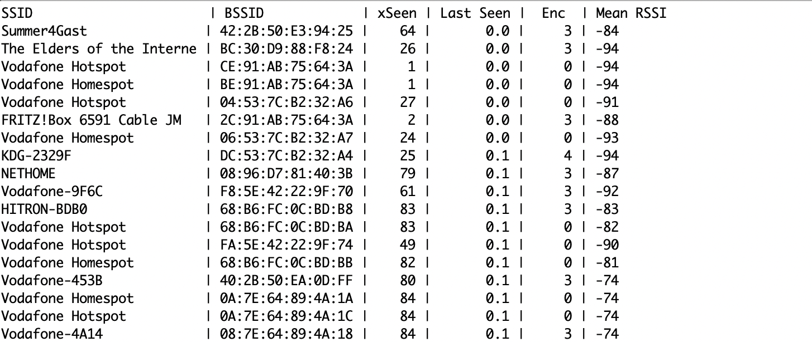

# Simple WiFi Scanner for ESP32

Monitors environment and keeps track of seen WiFi's

The RSSI is a running mean (calculated incrementally )

xSeen: How often was the network seen

Last seen: time in seconds since the network was last seen
